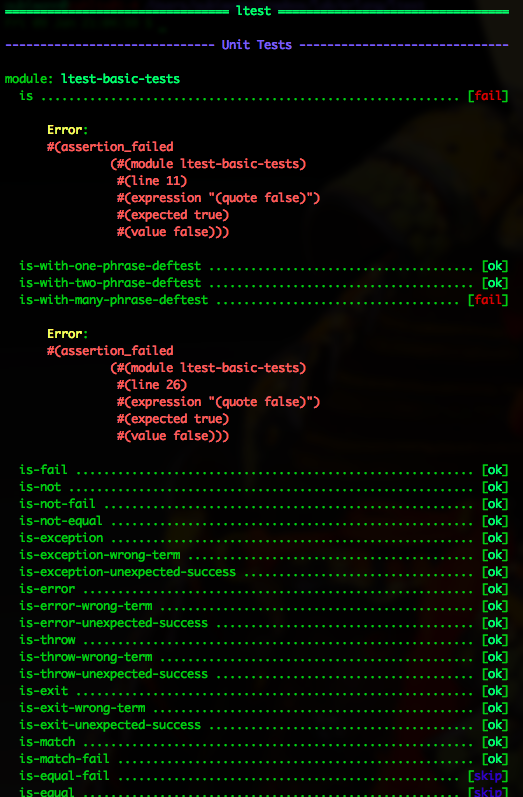

# ltest

[![][ltest-logo]][ltest-logo-large]

[ltest-logo]: priv/images/ltest-logo-small.png
[ltest-logo-large]: priv/images/ltest-logo-large.png

*A Unit, Integration, and System Tests Framework for LFE*


## Contents

* [Introduction](#introduction-)
* [Dependencies](#dependencies-)
* [EUnit Compatibility](#eunit-compatibility-)
* [Features](#features-)
* [Using ltest](#using-ltest-)
  * [Adding ltest to Your Project](#adding-ltest-to-your-project-)
  * [Structuring Your Tests](#structuring-your-tests-)
  * [Naming Rules](#naming-rules-)
  * [Creating Unit Tests](#creating-unit-tests-)
  * [Running Your Tests](#running-your-tests-)
  * [The LFE Test Runner](#the-lfe-test-runner-)
* [Dogfood](#dogfood-)


## Introduction [&#x219F;](#contents)

The original implementation of ltest (as lfeunit) was made due to some
difficulties in parsing the Erlang include file for EUnit, ``eunit.hrl``, by
LFE (it didn't convert all the Erlang macros). Good news: that has since been
fixed!

However, during lfeunit's early existence, additional features were added
-- things that EUnit didn't have or were clumsy to use. Such features, improved
in ltest, make the creation of not only unit tests, but system and integration
tests, easier and more consistent. These are briefly outlined in the next
section.

Of particular interest to those coming from the Clojure community, the macros
in this library are inspired by Clojure's excellent unit test framework.

Finally, features have been introduced into ltest that have no counterpart in
EUnit (e.g., defining tests to be skipped, using behaviours to "tag" types
of tests, and a REALLY BEAUTIFUL test runner, etc.)


## Dependencies [&#x219F;](#contents)

As of version 0.7.0, this project assumes that you have
[rebar3](https://github.com/rebar/rebar3) installed somwhere in your ``$PATH``.
It no longer uses the old version of rebar. If you do not wish to use rebar3,
you may use the most recent rebar2-compatible release of ltest: 0.6.3.


## EUnit Compatibility [&#x219F;](#contents)

The tests created with ltest are compatible with EUnit ane can be run from
either Erlang or LFE, using the standard EUnit listener or the ltest
listener (test runner).


### Features [&#x219F;](#contents)

* ``(deftest ...)`` for standard unit tests
* ``(deftestgen ...)`` for writing tests with generators, including the
  standard EUnit test fixtures (see naming caveat below)
* ``(deftestskip ...)`` for skipping unit tests
* ``(list ...)``-wrapped tests (of arbitrary depth) for use as test sets
* ``(tuple ...)``-wrapped tests for naming/describing tests (first element
  of tuple)
* ``(behaviour ltest-unit)`` - annotating a test module to be run as a unit
  test
* ``(behaviour ltest-integration)`` - annotating a test module to be run as an
  integration test
* ``(behaviour ltest-system)`` - annotating a test module to be run as a
  system test
* A custom test runner that over-rides EUnit behaviour and aesthetics


## Using ``ltest`` [&#x219F;](#contents)


### Adding ltest to Your Project [&#x219F;](#contents)

In order to use ltest in your project, all you need to do is add a rebar dep.
Generally, you only need ``ltest`` when running tests, so it's best to add it as
a dependency in the ``test`` profile. You'll also need to tell EUnit where to
take your tests from (``eunit_compile_otps``). In your ``rebar.config``:

```erlang
{profiles, [
  {test, [
    {deps, [
      {eunit_compile_opts, [{src_dirs, ["src", "test"]}]},
      {ltest, {git, "git://github.com/lfex/ltest.git", {tag, "0.9.0"}}}
    ]}
  ]}
]}.
```

Once you write some tests (see below for how to do that), you can then do this:

```bash
$ rebar3 eunit
```


### Structuring Your Tests [&#x219F;](#contents)

ltest doesn not support putting your unit tests directly in your modules. If
you do this, things may break or not work properly, even though Erlang's EUnit
does support it.

Instead, you should create a top-level directory in your project called
``test``. In ``test``, create a test cases module for every module your project
has, e.g., ``test/myproj-base-tests.lfe`` and ``test/myproj-util-tests.lfe``.
Obviously, if it makes sense to break things up in a more fine-grained manner,
feel free to do so :-)

Furthermore, ltest supports separating unit, integration, and system tests.
This is done using custom OTP behaviours. For each test cases module you have
created in ``./test``, be sure to set the behaviour in the ``(defmodule ...)``
form. For instance:

```cl
  (defmodule my-unit-tests
    (behaviour ltest-unit)
    (export ...))
```
And two more as well:

```cl
  (defmodule my-integration-tests
    (behaviour ltest-integration)
    (export ...))
```

or

```cl
  (defmodule my-system-tests
    (behaviour ltest-system)
    (export ...))
```

For a working example of such a structure, see the layout of the ``ltest``
project itself: it uses just such a setup.

To read more about the distinction between unit, integration, and system
tests, check out the Wikipedia
[article on testing](http://en.wikipedia.org/wiki/Software_testing#Testing_levels).


### Naming Rules [&#x219F;](#contents)

Keep in mind that your tests will be compiled to ``.beam`` and then run with
Erlang's eunit module. As such, your tests need to following the same
conventions that eunit establishes:

* Test module filenames should end in ``-tests``, e.g.,
  ``some-module-tests.lfe``.

* Test module and filename need to be the same, minus the extension. For
  example, ``test/unit-my-module-tests.lfe`` needs to be declared as
  ``(defmodule unit-my-module-tests ...) in the test case module``.

* If you chose *not* to use the ``deftest`` macro to build each unit test
  function, you will need to name your unit test functions with ``_test``
  appended to them. For example,
  ``(defun unit-my-function-negagive-check_test () ...)``. We recommend,
  however, that you use ``deftest`` instead, and obviate the need for ``_test
  ()`` boilerplate.


### Creating Unit Tests [&#x219F;](#contents)

ltest is entirely macro-based. ltest uses LFE to parse the Erlang macros in
the eunit header file. It also provides its own header file which defines macros
whose main purpose is to wrap the eunit macros in a more Lispy form.

ltest also provides a syntactic sugar macro for defining tests: ``deftest``.
Instead of writing something like this for your unit tests:

```cl

    (defun unit-my-function-test ()
      ...)
```

You can use ``deftest`` to write this:

```cl

    (deftest unit-my-function
      ...)
```

Note that the ``-test`` is no longer needed, nor is the empty argument list.

If you would like to use EUnit's fixtures feature, you must use another macro:

```cl
    (deftestgen unit-my-function
      ...)
```

See the unit tests in the ``test`` directory for example usage.


If you would like tests to be skipped, you can use this macro:

```cl
    (deftestskip unit-my-function
      ...)
```

This will simply make the test invisible to EUnit. EUnit doesn't actually
track user-skipped tests; it only tracks tests that are skipped do to issues
as perceived by EUnit.

However, ltest's test runner *does* track skipped tests and will report
these in its output.

Here is a more complete example:

```cl
    (defmodule unit-mymodule-tests
      (behaviour ltest-unit)
      (export all)
      (import
        (from ltest
          (check-failed-assert 2)
          (check-wrong-assert-exception 2))))

    (include-lib "deps/ltest/include/ltest-macros.lfe")

    (deftest is
      (is 'true)
      (is (not 'false))
      (is (not (not 'true))))

    (deftest is-not
      (is-not `'false))

    (deftest is-equal
      (is-equal 2 (+ 1 1)))
```

ltest is working towards full test coverage; while not there yet, the unit
tests for ltest itself provide the best examples of usage.


### Running Your Tests [&#x219F;](#contents)

The recommended way to run unit tests is to use ``lfetool``. Running
unit tests is now as easy as doing the following:

```bash
    $ lfetool tests build
    $ lfetool tests unit
```

Similarly, if your project has defined integration tests, you can do:

```bash
    $ lfetool tests integration
```

If you'd like to run unit, integration, and system tests together, run
the following:

```bash
    $ lfetool tests all
```


### The LFE Test Runner [&#x219F;](#contents)

ltest now includes a test runner which overrides the EUnit handlers with its
own. The original (and currently used) test runner functionality in lfetool
is actually a series of gross shell hacks around the verbose EUnit test
runner. More ``sed`` and manual ANSI terminal colors than is healthy for
anyone.

The new test runner code in ltest let's you skip that madness. For example,
this project has a ``make`` target that uses it:

```Makefile
check-runner-eunit: compile-no-deps compile-tests
    @PATH=$(SCRIPT_PATH) ERL_LIBS=$(ERL_LIBS) \
    erl -cwd "`pwd`" -listener eunit_progress -eval \
    "case 'ltest-runner':all() of ok -> halt(0); _ -> halt(127) end" \
    -noshell
```

Here's what the output looks like with failing and skipped tests:



End:


And here's what passing tests looks like:


End:


The rest of the ``make`` targets still use lfetool, and will continue to do
so, since lfetool will be updating to use ltest's new runner. If you'd like
to track the progress on these, here are the related tickets:
 * https://github.com/lfex/ltool/issues/4
 * https://github.com/lfe/lfetool/issues/160


## Dogfood [&#x219F;](#contents)

``ltest`` writes its unit tests in ``ltest`` :-) You can run them from the
project directory:

```bash
    $ make check
```

Which will give you output similar to the following:

```
    ------------------
    Running unit tests ...
    ------------------

    ======================== EUnit ========================
    module 'ltest-basic-tests'
      is ............................................. [ok]
      is-with-one-phrase-deftest ..................... [ok]
      is-with-two-phrase-deftest ..................... [ok]
      is-with-many-phrase-deftest .................... [ok]
      is-fail .............................. [0.003 s] [ok]
      is-not ......................................... [ok]
      is-not-fail .................................... [ok]
      is-equal ....................................... [ok]
      is-equal-fail .................................. [ok]
      is-not-equal ................................... [ok]
      is-not-equal-fail .............................. [ok]
      is-exception ................................... [ok]
      is-exception-wrong-class ....................... [ok]
      is-exception-wrong-term ........................ [ok]
      is-exception-unexpected-success ................ [ok]
      is-error ....................................... [ok]
      is-error-wrong-term ............................ [ok]
      is-error-unexpected-success .................... [ok]
      is-throw ....................................... [ok]
      is-throw-wrong-term ............................ [ok]
      is-throw-unexpected-success .................... [ok]
      is-exit ........................................ [ok]
      is-exit-wrong-term ............................. [ok]
      is-exit-unexpected-success ..................... [ok]
      is-match ....................................... [ok]
      is-match-fail .................................. [ok]
      Total module test time: 0.081 s
    module 'ltest-fixture-tests'
      setup-test-case ................................ [ok]
      setup-test-case ................................ [ok]
      setup-test-case ................................ [ok]
      setup-test-case ................................ [ok]
      setup-test-case ................................ [ok]
      setup-test-case ................................ [ok]
      foreach-test-case .............................. [ok]
      foreach-test-case .............................. [ok]
      setup-test-case ................................ [ok]
      setup-test-case ................................ [ok]
      foreach-test-case .............................. [ok]
      foreach-test-case .............................. [ok]
      Total module test time: 0.035 s
    module 'ltest-generated-tests'
      one-lambda ..................................... [ok]
      one-lambda-in-list ............................. [ok]
      many-lambdas-in-list ........................... [ok]
      many-lambdas-in-list ........................... [ok]
      many-lambdas-in-list ........................... [ok]
      lambda-with-nested-testset ..................... [ok]
      Total module test time: 0.017 s
    module 'ltest-named-tests'
      named-is ....................................... [ok]
      named-is-not-fail .............................. [ok]
      named-testset-with-one ......................... [ok]
      named-testset-with-two ......................... [ok]
      named-testset-with-three ....................... [ok]
      named-testset-nested ........................... [ok]
      named-testset-deeply-nested .................... [ok]
      Total module test time: 0.021 s
    module 'ltest-testset-tests'
      testset-with-one ............................... [ok]
      testset-with-two ............................... [ok]
      testset-with-three ............................. [ok]
      testset-nested ................................. [ok]
      testset-deeply-nested .......................... [ok]
      Total module test time: 0.015 s
    =======================================================
      All 56 tests passed.
```
